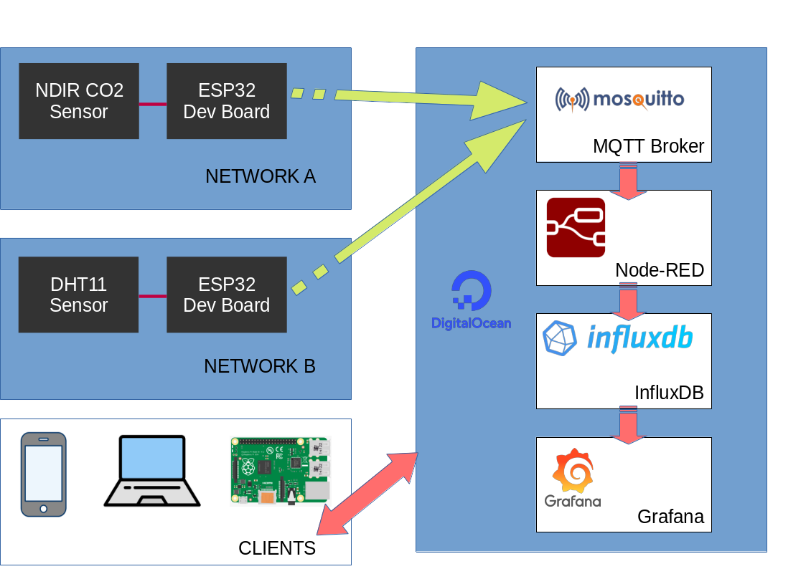

# ESP32 connected sensors, MQTT, NodeRED, InfluxDB, Grafana stack for real world data monitoring

- Sensor nodes (ESP32) publish data over MQTT to a remote broker (Digital Ocean Droplet)
- Node-RED flow publishes this data to an influxdb bucket
- Current and historic data is displayed on a Grafana dashboard
- Clients can connect over the internet to the Grafana dashboard or upstream applications to access data
